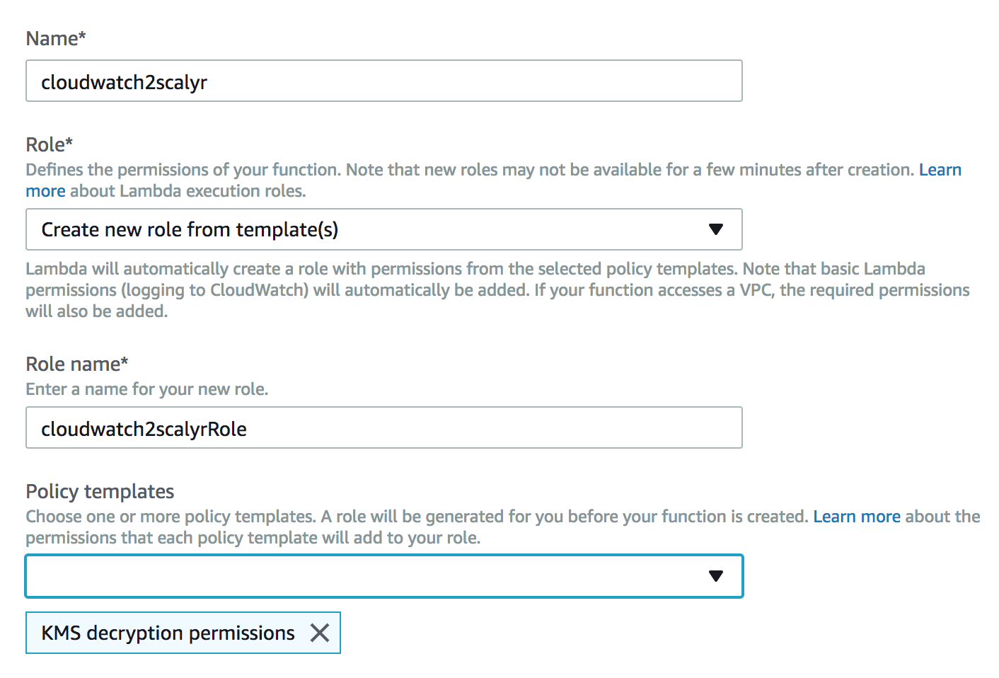
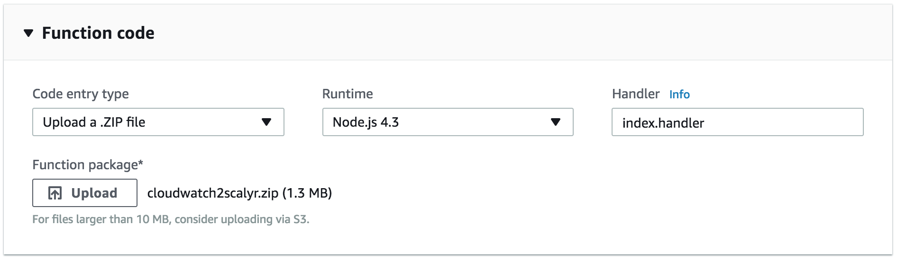
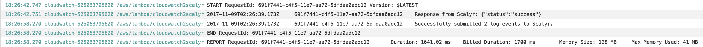

# Streaming Logs from CloudWatch to Scalyr

In order to send logs to Scalyr in near-real-time, there are two steps involved:

1. Create an AWS Lambda Function that receives CloudWatch log events, transforms them to a Scalyr-compatible message, and posts that to a Scalyr API.
2. Set up your CloudWatch Log Group(s) with a subscription filter that will stream CloudWatch log data to that lambda function.

If you haven’t set up a "cloudwatch2scalyr" lambda function yet, both of these steps will be taken care of in the Lambda Function creation wizard as described below.

**NOTE:** At some point (later in the instructions) you'll be asked to upload a ZIP file to Amazon. You can find the latest pre-built copy [here](https://github.com/scalyr/cloudwatch2scalyr/blob/master/dist/cloudwatch2scalyr.zip), or you can build your own locally using the make_distribution.sh shell script.
<br>
<br>

## Start the Lambda Function creation wizard

First, go to the Lambda Management Console in AWS. For us-east-1, the link is [https://console.aws.amazon.com/lambda/home?region=us-east-1#/functions?display=list](https://console.aws.amazon.com/lambda/home?region=us-east-1#/functions?display=list) – if you’re in a different region, you can substitute that region for "us-east-1" in the URL above.

Once you navigate to that page, you should see something like this:

<div style="text-align:center"></div>
<br>

Click "Create a Lambda function" - this will start the wizard.
<br>
<br>

## Pick runtime and function blueprint

On the next page, you’ll need to pick a "runtime" and a function “blueprint”. Choose “Node.js 4.3” for the runtime and click on “Blank Function” for the blueprint, as shown below:

<div style="text-align:center"></div>
<br>

## Configure trigger

On the next page, you’ll configure a trigger to invoke the function. Click on the rounded dashed-line rectangle to do this and then select "CloudWatch Logs" from the dropdown that appears:

<div style="text-align:center"></div>
<br>

At this point, you’ll need to select a Log Group and provide a Filter Name (which can be anything, but it is required). Also, check the "Enable trigger" checkbox:

<div style="text-align:center"></div>
<br>

## Supply function name and upload code

On the next screen, you’ll need to supply a function name and an optional description, as well as upload the lambda function code (which is in cloudwatch2scalyr.zip):

<div style="text-align:center"></div>
<br>

## Supply environment variables

You’ll need to specify your Scalyr "Write Logs" API key as an environment variable on this screen (scroll down a bit). In order to do this, you’ll need to create a KMS encryption key if you don’t have one in your account already (beyond the scope of this document). Select your encryption key and enter an environment variable:

* Enter "SCALYR_WRITE_LOGS_KEY" in the first column (no quotes)
* Provide your account’s actual Scalyr "Write Logs" API Key in the second column.
* Click "Encrypt".

Once you’ve done this, you should see something like:

<div style="text-align:center"></div>
<br>

There are a couple of additional environment variables you can pass to the code - `USE_ADD_EVENTS_API`, `PARSER_NAME`, and `SCALYR_BASE_URL`. (These should not be encrypted.)
* In general, `USE_ADD_EVENTS_API` should be false (and you don’t actually need to specify it unless you want it to be true).
* `PARSER_NAME` is optional as well and refers to a specific custom parser defined using the Scalyr UI - if not specified, the default parser is used.
* `SCALYR_BASE_URL` defaults to `https://www.scalyr.com` and selects the Scalyr region to which you want to upload your logs, such as  `https://upload.eu.scalyr.com`.  *Note:* If this parameter is configured incorrectly, you will not get error messages from Scalyr during log upload; AWS logs of this Lambda function will look as if everything is working, but the logs won't show in Scalyr.

<div style="text-align:center"></div>
<br>

## Define a role for your function

The last step on this page is to define a role for your function. In the next section of the page, choose "Create new role from template(s)" from the Role dropdown, give the role a name, and choose “KMS decryption permissions” from the Policy Templates dropdown:

<div style="text-align:center"></div>
<br>

## Finalize the installation

Now, click "Next". On the next page, click “Create Function”. You should see a screen like:

<div style="text-align:center"></div>

At this point, you’re done!
<br>
<br>

## Try it out

Try it out by triggering some kind of action that will generate CloudWatch logs. This should cause events to be streamed to Scalyr (it may take a few seconds for them to show up):

<div style="text-align:center"></div>
<br>
<br>

As you’ll notice, the log messages that show up in Scalyr are identical to those you would see in CloudWatch. Also note the serverHost field ("cloudwatch-536….") and logfile field (“/aws/lambda/airQuality”). You can set up a custom parser in Scalyr based on the log file name (it should match your PARSER_NAME environment variable). You can also customize the serverHost field via the `SERVER_HOST` environment variable.
<br>
<br>

## A bit about the addEvents transformation code (experimental)

This is an **experimental** feature that allows you to do some parsing in AWS Lambda itself by modifying the code in cloudwatch2scalyr.
You can also customize the `serverHost`, `logfile`, and `parser` on a per-log-group basis by setting an environment variable, `LOG_GROUP_OPTIONS`.

The cloudwatch2scalyr.zip file contains one main file (index.js) as well as supporting Node.js libraries. If you wish to pre-parse interesting fields from the logs, you’ll probably be most interested in the *transformToAddEventsMessage* function, which is responsible for translating from CloudWatch-speak to Scalyr-speak. **Note: at this time, we don’t recommend using the addEvents API from Amazon Lambda (use uploadLogs, the default, instead).**

To use `LOG_GROUP_OPTIONS`, set the variable to a JSON string with log group names as keys, e.g.:

```javascript
{
  "API-Gateway-Execution-Logs_abcdef12345/production": {
    "serverHost": "API-Gateway",
    "logfile": "My-Friendly-Api-Name",
    "parser": "myGatewayParser"
  },
  "API-Gateway-Execution-Logs_12345abcdef/production": {
    "serverHost": "API-Gateway",
    "logfile": "My-Other-Api"
  }
}
```

Defaults are used for any omitted fields.

For more information about the format Scalyr expects, see this link: [https://www.scalyr.com/help/api#addEvents](https://www.scalyr.com/help/api#addEvents)

The function can be found [here](src/index.js#L28).
